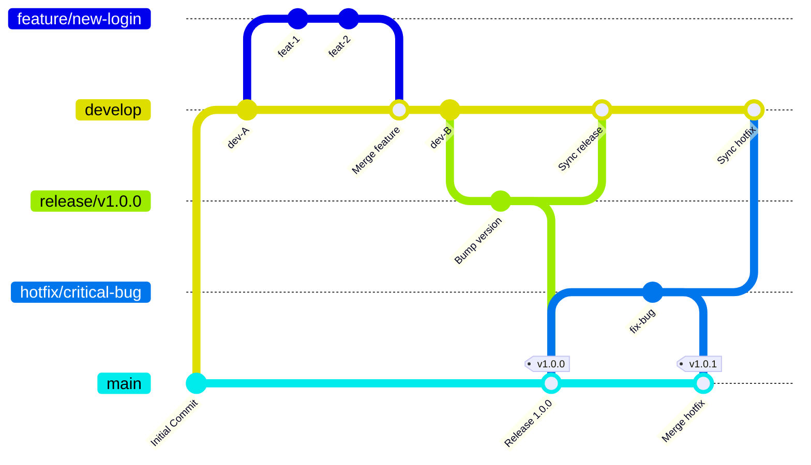
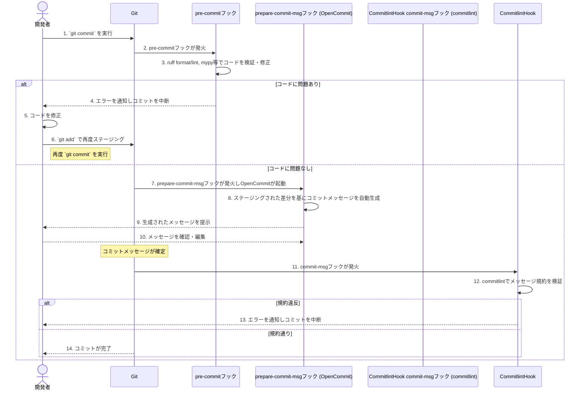
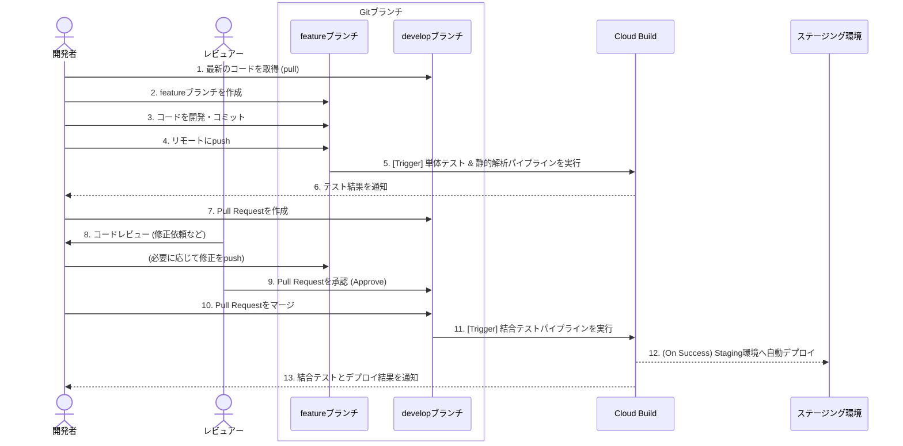
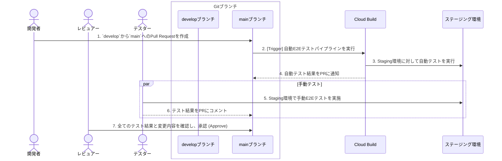
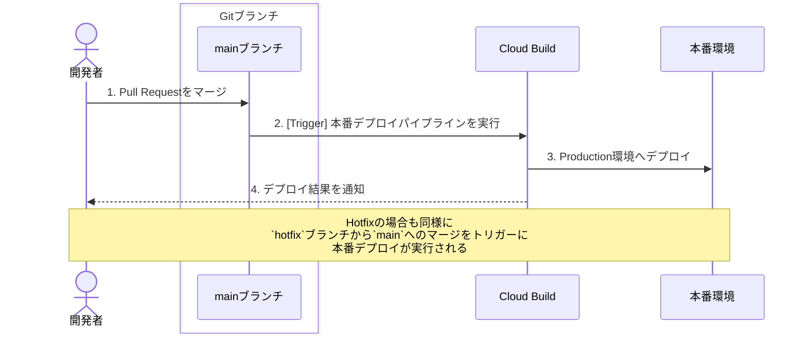

# 開発ガイドライン

---

このドキュメントは、本プロジェクトにおける開発の進め方、コーディングスタイル、利用ツールに関する規約を定めたものです。開発に参加するすべてのメンバーは、このガイドラインに従ってください。

開発環境のセットアップについては、プロジェクトルートの [`README.md`](../README.md) を参照してください。

---

## 1. ディレクトリ構成
本プロジェクトの標準的なディレクトリ構成と、各ディレクトリの役割は以下の通りです。

```
ai-search-app/
├── backend/                # バックエンドアプリケーション
├── frontend/               # フロントエンドアプリケーション
├── docs/                   # ドキュメント
├── scripts/                # 開発支援スクリプト
│   └── hooks/              # Gitフック用スクリプト
├── .python-version         # Pythonバージョン指定
├── .nvmrc                  # Node.jsバージョン指定
├── pyproject.toml          # Pythonパッケージ管理設定
├── uv.lock                 # Python依存関係のロックファイル
├── package.json            # 開発支援ツール依存関係
├── pnpm-lock.yaml          # Node.js依存関係のロックファイル
├── commitlint.config.cjs   # commitlint設定
├── .opencommit-commitlint  # OpenCommit用プロンプト設定
├── .pre-commit-config.yaml # pre-commitフック設定
├── .gitignore              # Git除外設定
└── README.md
```

- **`backend/`**:
  - APIサーバーやバッチ処理などのバックエンドコードを配置します。

- **`frontend/`**:
  - Webアプリケーションのフロントエンドコードを配置します。

- **`scripts/hooks/`**:
  - Gitフック用のカスタムスクリプトを配置します。pre-commitから参照されます。
  - 例: `check-branch-name.sh` (ブランチ名バリデーション)

- **設定ファイル群**:
  - **`.python-version`, `.nvmrc`**:
    - プロジェクトで使用する言語ランタイムのバージョンを定義します。開発環境の一貫性を保つために使用されます。
  - **`pyproject.toml`, `uv.lock`**:
    - Pythonプロジェクトのメタデータや依存関係（ライブラリ）を管理します。`uv.lock` は依存関係のバージョンを固定し、再現可能な環境構築を保証します。
  - **`package.json`, `pnpm-lock.yaml`**:
    - プロジェクトの開発支援に使用するNode.js製ツール（`commitlint`, `opencommit`など）の依存関係を管理します。`pnpm-lock.yaml` は依存バージョンの固定用です。
  - **`.pre-commit-config.yaml`**:
    - コミット時に自動実行される静的解析ツールやフォーマッターの設定を定義します。
  - **`commitlint.config.cjs`, `.opencommit-commitlint`**:
    - `commitlint.config.cjs` はコミットメッセージのフォーマット規約を定義します。
    - `.opencommit-commitlint` は AIによるメッセージ生成 (`opencommit`) 時のプロンプトやルールを定義する設定ファイルです。
  - **`.gitignore`**:
    - Gitの管理対象から除外するファイルやディレクトリ（`node_modules`, `.venv`, `.env` など）を指定します。

---

## 2. 開発ワークフローとブランチ戦略

本セクションでは、プロジェクトで採用するGitブランチ戦略と、それに伴う開発ワークフローについて解説します。継続的な開発と安定したリリースを両立させることを目的としています。

### 2.1. 開発フローの全体像

本プロジェクトの開発フローを視覚的に表現すると以下のようになります。`develop` ブランチを中心に開発が進み、`main` ブランチはリリースごとのスナップショットとして機能します。



### 2.2. ブランチの種類と役割

#### 主要ブランチ

| ブランチ名 | 役割 | マージポリシー | 備考 |
| - | - | - | - |
| **`main`** | 本番環境（Production）の最新版 | `develop`, `hotfix` からのみ | **直接コミット禁止** |
| **`develop`** | 開発中の最新バージョン | `feature`, `bugfix` 等からのマージ先 | ステージング環境へデプロイ |

#### 作業ブランチの種類

各ブランチ種別（プレフィックス）の定義は以下の通りです。

| プレフィックス | 役割 | 基点 | マージ先 | 命名例 |
| - | - | - | - | - |
| **`feature/`** | 新機能の開発 | `develop` | `develop` | `feature/add-login-page` |
| **`bugfix/`** | バグ修正 | `develop` | `develop` | `bugfix/fix-header-bug` |
| **`hotfix/`** | 本番環境の緊急修正 | `main` | `main`, `develop` | `hotfix/security-patch` |
| **`release/`** | リリース準備 | `develop` | `main`, `develop` | `release/v1.2.0` |
| **`docs/`** | ドキュメントのみの変更 | `develop` | `develop` | `docs/update-readme` |
| **`chore/`** | 雑務（ビルド設定等） | `develop` | `develop` | `chore/update-dependencies` |

### 2.3. ブランチの命名規則

本プロジェクトでは、ブランチの命名規則として **[Conventional Branch 1.0.0](https://conventional-branch.github.io/#specification)** を採用します。

#### 2.3.1. フォーマット

ブランチ名は、以下のフォーマットに従います。

```
<type>/<description>
```

- **`<type>`**: 上記「作業ブランチの種類」で挙げたプレフィックス（`feature`, `bugfix`など）。
- **`<description>`**: 作業内容を表す簡潔な説明。

#### 2.3.2. 命名のルール (description)

-   **小文字の英数字、ハイフン、ドットのみを使用する**:
    -   単語の区切りにはハイフン (`-`) を使用します。アンダースコア (`_`) やスペースは使用できません。
    -   `release` ブランチの場合のみ、バージョン番号を表すためにドット (`.`) を使用できます。
-   **記号を連続させない、先頭や末尾に使用しない**:
    -   `feature/new--login` や `feature/-new-login` はNGです。
-   **明確かつ簡潔に**:
    -   ブランチ名は、その作業内容がわかるように記述します。

#### 2.3.3. 特別ルール

-   **`release`ブランチ**:
    -   `release`ブランチは必ず`release/vX.Y.Z`形式（セマンティックバージョニング）で作成する必要があります。
    -   例: `release/v1.0.0`, `release/v0.1.0`
    -   `release/1.0.0`（vが無い）や`release/v1.0`（パッチバージョンが無い）は不可
-   **`hotfix`ブランチ**:
    -   `hotfix`ブランチは説明的な名前（例: `hotfix/security-patch`）で作成します。
    -   バージョン番号はブランチ名に含めません。最新タグから自動でパッチバージョンがインクリメントされます。

> [!NOTE]
> **なぜ`hotfix`ブランチでは自動バージョンインクリメントを採用するのか？**
>
> 1.  **セマンティックバージョニングの原則**: hotfixは必ずパッチバージョン（`X.Y.Z`の`Z`）を上げるため、自動採番が可能です。
> 2.  **緊急時の手間削減**: 本番環境の緊急修正時に、バージョン番号を考えたりブランチ名を変更したりする手間を省きます。
> 3.  **連続修正への柔軟性**: hotfix作業中にさらに問題が見つかった場合でも、ブランチ名を変更せずに同じブランチで作業を続けられます。
> 4.  **一貫性の維持**: リリース時に自動で正しいバージョンが付与されるため、人為的ミスを防げます。

#### 2.3.4. ブランチ名の自動チェック

ブランチ名が命名規則に従っているかは、`git push`時に自動的にチェックされます。

-   **チェックタイミング**: `git push`実行時（pre-pushフック）
-   **チェック内容**:
    -   ブランチ名が`<type>/<description>`形式になっているか
    -   `type`が許可されたもの（`feature`, `bugfix`, `hotfix`, `release`, `docs`, `chore`）か
    -   `description`が命名ルールに従っているか
    -   `release`ブランチが`vX.Y.Z`形式になっているか
    -   `hotfix`ブランチが説明的な名前（バージョン番号を含まない）になっているか
-   **除外**: `main`, `develop`ブランチはチェック対象外
-   **実装**: `.pre-commit-config.yaml`の`check-branch-name`フック
-   **スクリプト**: [`scripts/hooks/check-branch-name.sh`](../scripts/hooks/check-branch-name.sh)

不正なブランチ名の場合、`git push`が失敗し、エラーメッセージが表示されます。

### 2.4. 具体的な開発手順

#### 2.4.1. 一般的な開発フロー（新機能開発）

1.  **ブランチの作成**:
    -   ローカルの`develop`ブランチを最新の状態にします (`git pull origin develop`)。
    -   `develop`ブランチから`feature`ブランチを作成します (`git checkout -b feature/my-new-feature`)。

2.  **開発とコミット**:
    -   機能開発を行い、作業の区切りが良い単位でコミットします。コミットメッセージは規約に従ってください。

3.  **プッシュ**:
    -   作業ブランチをリモートリポジトリにプッシュします (`git push origin feature/my-new-feature`)。
    -   プッシュ後、自動的に単体テストと静的解析が実行されます（詳細は[6.2.1. 単体テスト & 静的解析](#621-単体テスト--静的解析)を参照）。

4.  **Pull Requestの作成**:
    -   GitHub上で、`feature/my-new-feature`ブランチから`develop`ブランチへのPull Requestを作成します。
    -   PRのテンプレートに従い、変更の概要、目的、テスト内容などを記述します。

5.  **コードレビューと修正**:
    -   チームメンバーによるコードレビューを受けます。
    -   指摘事項があれば、ローカルの`feature`ブランチで修正し、再度プッシュします。PRは自動的に更新されます。

6.  **マージ**:
    -   承認（Approve）後、PRをマージします。
    -   作業ブランチは削除します。

#### 2.4.2. リリースフロー

リリース作業は、`develop` ブランチから `main` ブランチへの Pull Request マージをトリガーとして、CI/CDパイプラインにより自動的に実行されます。

詳細なフローや自動化の仕組みについては、「[6. CI/CD ガイドライン](#6-cicd-ガイドライン)」、特に「[6.3.3. リリース](#633-リリース)」を参照してください。

#### 2.4.3. ブランチ保護ルールの設定

`main`ブランチへのマージ前に、必須のチェックが成功することを保証するため、GitHubのブランチ保護ルール（Branch Protection Rules）を設定してください。

**初期設定手順**: [README.md - GitHubリポジトリの初期設定](../README.md#7-githubリポジトリの初期設定) を参照してください。

**ブランチ保護ルールの効果**:

- **PR必須化**: `main`ブランチへの直接プッシュを禁止し、必ずPull Requestを経由させます
- **チェック必須化**: CI/CDの単体テスト、静的解析などが成功するまでマージをブロックします
- **最新状態の強制**: マージ前に、ブランチが`main`の最新状態と同期していることを要求します

これにより、品質チェックが失敗した状態でのマージを防ぎ、`main`ブランチの安定性を保ちます。

## 3. コミットに関する規約

### 3.1. コミットメッセージ規約

コミットメッセージは、変更内容を明確に伝えるための重要な情報です。本プロジェクトでは `Conventional Commits` に基づく規約と、`opencommit` によるメッセージの自動生成を採用しています。

#### 3.1.1. コミットメッセージの自動生成 (opencommit)

`opencommit` は `git commit` 時にフックとして実行され、ステージングされた変更内容からAIがコミットメッセージを自動生成します。開発環境のセットアップでフックが有効化されていることが前提です。

`git commit` を実行すると自動的に `opencommit` が起動し、コミットメッセージの生成を対話形式でサポートします。生成されたメッセージを確認し、必要に応じて修正してからコミットを完了してください。

#### 3.1.2. コミットメッセージのフォーマット

コミットメッセージは `commitlint` によって以下の規約に従っているかチェックされます。

-   **基本フォーマット:** [Conventional Commits](https://www.conventionalcommits.org/) に従います。
    ```
    <type>(<scope>): <subject>
    ```
-   **独自規約 (日英併記):**
    -   ヘッダー（1行目）は、**`英語コミットメッセージ / 日本語の要約`** の形式で記述する必要があります。
    -   `English / Japanese` の間は ` / `（スペース、スラッシュ、スペース）で区切ってください。
    -   英語部分はASCII文字のみを使用してください。

    **良い例:**
    ```
    feat(auth): add login feature / feat(auth): ログイン機能の追加
    ```
    **悪い例:**
    ```
    feat(auth): ログイン機能を追加
    feat(auth): add login feature
    feat(auth): add login feature/ログイン機能の追加
    ```

#### 3.1.3. コミットメッセージのチェック

このチェックは `pre-commit` の `commit-msg` フックとして設定されており、`git commit` 時に自動的に実行されます。規約違反がある場合はコミットが失敗しますので、メッセージを修正してください。

#### 3.1.4. 複数の変更をコミットする場合の注意点

ステージングされたファイルに複数の異なる関心事（ロジックの変更、ドキュメントの修正など）が含まれている場合、`opencommit`が複数のコミットメッセージ候補を生成することがあります。

Conventional Commitsの理想は「1コミット = 1つの関心事」です。そのため、複数のメッセージが提案された場合は、以下のいずれかの対応を推奨します。

1.  **コミットを分割する（推奨）**
    現在のコミットを中断し (`Ctrl+C`等)、`git add -p` や `git add <file>` を使って関心事ごとにファイルをステージングし直し、それぞれ個別にコミットします。これは最もクリーンなアプローチです。

2.  **メッセージを1つにまとめる**
    変更内容が密接に関連している場合に限り、`opencommit`が提案した複数のメッセージを、より抽象的で包括的な1つのメッセージに手動で編集します。

### 3.2. コミットの中断・修正方法

#### コミットを中断する
`opencommit`によってVimなどのエディタが起動した後、コミット自体を取りやめたい場合は、単に`:q`で閉じるのではなく、必ず以下のコマンドでエディタを終了してください。
```vim
:cq
```
これにより、エディタがエラーを返して終了するため、Gitのコミットプロセスが安全に中断されます。

#### コミットメッセージを修正する
`commitlint`のチェックを通過できなかった場合や、`opencommit`の生成内容をやり直したい場合の手順です。

**A. 直前のコミットを修正する**

1.  以下のコマンドを実行し、直前のコミットを取り消して、変更内容をステージングエリアに戻します。
    ```bash
    git reset --soft HEAD~1
    ```
2.  再度`git commit`を実行します。
    ```bash
    git commit
    ```
3.  これにより`opencommit`が再起動し、コミットメッセージを新たに生成できます。

> **Note:** この操作も履歴の書き換えです。`main`ブランチなど、既に他の開発者と共有しているブランチにプッシュ（push）済みのコミットには実行しないでください。

**B. 過去のコミットを修正する (複数前)**

インタラクティブ・リベース（`git rebase -i`）と`edit`を組み合わせることで、過去のコミットに対してもフックを再実行します。

1.  修正したいコミットが含まれる範囲を指定して、リベースを開始します。例えば「3つ前までのコミット」を対象にする場合は以下のコマンドを実行します。
    ```bash
    git rebase -i HEAD~3
    ```
2.  エディタが起動し、対象コミットの一覧が表示されます。メッセージを修正したいコミットの行の先頭にある `pick` という単語を `edit` (または `e`) に書き換えて、ファイルを保存・終了します。
    ```
    # 例: e4f5g6h のメッセージを修正する場合
    edit e4f5g6h fix: some bug  # <-- pick を edit に変更
    pick a1b2c3d feat: old feature
    pick i7j8k9l docs: update README
    ```
3.  リベースが`edit`を指定したコミットで一時停止します。ここで、そのコミットを取り消し、ステージングに戻します。
    ```bash
    git reset --soft HEAD~1
    ```
4.  再度`git commit`を実行して、`opencommit`を起動しメッセージを再生成します。
    ```bash
    git commit
    ```
5.  最後に、リベースを続行して完了させます。
    ```bash
    git rebase --continue
    ```

> **Warning:** 過去のコミットの修正は、コンフリクトが発生する可能性がより高い複雑な操作です。共有ブランチにプッシュ済みのコミットに対して行う場合は、必ずチームで合意の上、細心の注意を払って実施してください。

---

## 4. 品質保証のプロセス

コードの品質は、自動化されたチェックと人間によるレビューの組み合わせによって担保されます。

### 4.1. 静的解析・フォーマット (`pre-commit`フック)

本プロジェクトでは、コミット前にコードの品質を自動的にチェックするため `pre-commit` を導入しています。開発環境のセットアップでフックを有効化すると、`git commit` を実行するたびに、`.pre-commit-config.yaml` で定義されたチェックが自動的に実行されます。

#### 4.1.1. チェック内容

実行される主なチェックは以下の通りです。

-   **基本チェック (`pre-commit-hooks`):**
    -   `trailing-whitespace`: 行末の不要なスペースを削除します。
    -   `end-of-file-fixer`: ファイルの末尾に空行を1行確保します。
    -   `check-yaml`: YAMLファイルの構文をチェックします。
    -   `check-added-large-files`: 巨大なファイルがコミットされるのを防ぎます。
    -   `detect-private-key`: プライベートキーが誤ってコミットされるのを防ぎます。
-   **フォーマット (`ruff format`):**
    -   Pythonコードを規約に沿って自動的にフォーマットします。
-   **リンティング (`ruff`):**
    -   Pythonコードの静的解析を行い、潜在的なバグやスタイル違反を検出・修正します。
-   **型チェック (`mypy`):**
    -   Pythonコードの型ヒントを静的にチェックします。設定は `--strict` ですが、インポートエラーは無視します (`--ignore-missing-imports`)。
-   **その他のチェック:**
    -   `requirements-txt-fixer`: requirements.txtのアルファベット順ソートと重複削除
    -   `mixed-line-ending`: 混在した改行コードを統一
    -   `check-branch-name`: ブランチ名の命名規則を検証（詳細は[2.3.3](#233-ブランチ名の自動チェック)参照、`git push`時のみ実行）

#### 4.1.2. 手動でのチェック実行
コミットせずに手動でチェックを実行したい場合は、以下のコマンドを使用できます。

```bash
# すべてのファイルをフォーマット
ruff format .

# すべてのファイルに対してリンターを実行（自動修正付き）
ruff check . --fix

# 型チェックを実行
mypy .
```

### 4.2. コミットフックの全体像

`git commit` を実行すると、Gitフックを通じてコードの自動チェック・整形、コミットメッセージの自動生成、メッセージ規約の検証が実行されます。全体の流れは以下の通りです。



### 4.3. Pull Request (PR) とコードレビュー

-   **PRの作成ルール**:
    -   PRのタイトルは、コミットメッセージの規約に準拠します。
    -   PRの本文には、変更の背景（Why）、具体的な変更内容（What）、影響範囲を記述します。
    -   PRテンプレートを使用してください: [`.github/pull_request_template.md`](../.github/pull_request_template.md)
    -   作業中のPRは、タイトルに`[WIP]`を付けるか、Draft Pull Requestとして作成します。
-   **コードレビューのガイドライン**:
    -   **レビュワーへ**: 変更の意図を尊重し、高圧的な表現を避けます。「なぜこの実装にしたのですか？」のように質問形式で意図を確認することを推奨します。
    -   **作成者へ**: レビューコメントに感謝し、感情的にならないようにします。すべての指摘を反映する必要はなく、議論を通じて最適な解を見つけます。

### 4.4. テストの方針

コードの品質と信頼性を担保するため、本プロジェクトでは複数のテストレベルを設けています。

-   **基本ルール**:
    -   新しい機能を追加する際は、可能な限りユニットテストを追加します。
    -   重大なバグを修正した際は、再発防止のためのテストコードを追加します。

#### 4.4.1. テストの実行環境とタイミング

各テストは、開発者のローカル環境とCI/CDパイプラインの両方で実行されます。それぞれの環境と実行タイミングは以下の通りです。CI/CDパイプラインの具体的なトリガーについては、「[5. CI/CD ガイドライン](#5-cicd-ガイドライン)」セクションも参照してください。

| テスト種別 | 実行環境 | 実行タイミング・方法 | 主な目的 |
| - | - | - | - |
| **単体試験** | ローカル / CI | **ローカル:** `uv run test` で手動実行<br>**CI:** `feature`ブランチへのpush時、`develop`へのPR作成時に自動実行 | 個々の関数やモジュールの動作保証 |
| **結合試験** | CI / ステージング | **CI:** `develop`ブランチへのマージ時に自動実行 | 複数モジュール間の連携確認 |
| **E2E試験**  | CI / ステージング | **CI (自動):** `main`ブランチへのPR作成時に、ステージング環境に対して自動実行<br>**手動:** 新機能の追加時やリリース前に、ステージング環境で都度実行 | ユーザー操作シナリオ全体の動作保証と、UX（使い勝手）の最終確認 |

#### 4.4.2. テストの種類とスコープ

各テストが対象とする範囲（スコープ）と目的は以下の通りです。ピラミッドのように、単体試験が最も数が多く、E2E試験が最も少なくなるのが理想です。

**1. 単体試験 (Unit Test)**

-   **目的**: 一番小さな単位（関数やメソッド、コンポーネントなど）が、個別に正しく動作するかを確認します。
-   **視点**: 開発者の視点（実装の詳細を理解している）
-   **具体例**:
    -   ある関数に特定の入力（引数）を与えたとき、期待通りの出力（戻り値）が返ってくるか。
    -   入力が不正な場合に、正しくエラーがスローされるか。
    -   例えば、ファイル名を引数に取り、その拡張子を返す `get_file_extension(filename)` という関数があったとします。
        -   `get_file_extension("data.csv")` を実行したら `"csv"` が返ってくるか。
        -   `get_file_extension("archive.tar.gz")` を実行したら `"gz"` が返ってくるか。
        -   `get_file_extension("README")` を実行したら `None` や空文字が返ってくるか。
        -   `get_file_extension(None)` を実行したら `TypeError` が発生するか。

**2. 結合試験 (Integration Test)**

-   **目的**: 複数のコンポーネント（モジュールやクラス、マイクロサービスなど）を組み合わせたときに、それらが連携して正しく動作するかを確認します。
-   **視点**: 開発者の視点（システムの内部構造を理解している）
-   **具体例**:
    -   Webアプリケーションで、APIリクエストを送信し、データベースに正しくデータが保存・更新されるか。
    -   あるモジュールの出力が、別のモジュールの入力として正しく処理されるか。
    -   例えば、「AI検索アプリ」で考えてみましょう。
        1.  ユーザーが検索クエリを入力する「① UIコンポーネント」
        2.  クエリを受け取り、AIモデルに問い合わせる「② APIサーバー」
        3.  検索結果を保存する「③ データベース」
        -   結合試験では、UIは使わずに直接「② APIサーバー」にリクエストを送り、「③ データベース」の状態が期待通りに変わるかを確認します。外部のAIモデルへの接続部分は、本物の代わりにダミー（モック）を使うことも多いです。

**3. E2E試験 (End-to-End Test)**

-   **目的**: 実際のユーザーと同じようにアプリケーション全体を操作し、最初から最後まで（End-to-End）のシナリオが正しく動作するかを確認します。
-   **視点**: ユーザーの視点（アプリケーションの内部実装は知らない）
-   **具体例**:
    -   Webサイトにアクセスし、ログインボタンをクリックし、フォームに情報を入力してログインし、特定のページが表示されるまでの一連の流れ。
    -   ECサイトで商品を検索し、カートに追加し、購入手続きを完了させるまでの一連の操作。
    -   「AI検索アプリ」の例で言えば、
        1.  ブラウザを自動で起動する。
        2.  検索ページを開く。
        3.  検索ボックスに「今日の天気は？」と入力してEnterキーを押す。
        4.  検索結果が画面に正しく表示されることを確認する。
        -   この試験では、UI、API、データベース、外部サービスなど、本番とほぼ同じ環境のすべてが連携して動作することを確認します。CI/CDパイプラインによる主要シナリオの**自動テスト**と、開発者やQA担当者による探索的な**手動テスト**の両方のアプローチで実施されます。

---

## 5. その他の規約

### 5.1. 依存関係の管理

-   **目的**: プロジェクトの依存ライブラリを健全に保ち、意図しない更新を防ぎます。
-   **ルール**:
    -   新しいライブラリを追加する際は、PR上でチームに提案し、承認を得ることを推奨します。
    -   ライブラリのバージョンは、セキュリティアップデートを除き、むやみに更新しません。

---

## 6. TerraformによるIaC開発ガイドライン

本セクションでは、Google Cloud Platform (GCP) のインフラをコードで管理するためのTerraform開発ガイドラインを定めます。

### 6.1. 基本方針

- **目的**: インフラ構成の再現性、可視性、再利用性を高めることを目的とします。
- **ツール**: Terraformを利用し、GCPリソースを宣言的に管理します。
- **状態管理**: TerraformのStateファイルは、`Google Cloud Storage`バケットを利用してチームで共有・ロックします。ローカルでのState管理は禁止です。

### 6.2. ディレクトリ構成

Terraformコードは、目的別に整理された以下のディレクトリ構成を推奨します。

```
terraform/
├── environments/
│   ├── development/  # 開発環境
│   │   ├── main.tf
│   │   ├── variables.tf
│   │   └── backend.tf
│   └── production/   # 本番環境
│       ├── main.tf
│       ├── variables.tf
│       └── backend.tf
│
└── modules/
    └── gcs/
        ├── main.tf
        ├── variables.tf
        └── outputs.tf
```

- **`environments/`**: `development`, `production`など環境ごとのルート構成を配置します。ここでモジュールを呼び出し、環境固有の変数を定義します。
- **`modules/`**: 再利用可能なコンポーネント（VPC, GCS, GKEなど）をモジュールとして作成します。

### 6.3. 開発フロー

1.  **ブランチの作成**: `feature/add-gcs-module` のように、`develop`からブランチを作成します。
2.  **コードの記述**: `modules/` にモジュールを、`environments/` に呼び出しコードを記述します。
3.  **初期化**: `terraform init` を実行します。`backend.tf`で指定したGCSバケットにStateが保存されます。
4.  **フォーマット**: `terraform fmt -recursive` を実行し、コードを整形します。
5.  **静的解析**: `terraform validate` を実行し、構文エラーがないか確認します。
6.  **実行計画**: `terraform plan` を実行し、変更内容を確認します。
7.  **適用**:
    - 開発環境: `environments/development` ディレクトリで `terraform apply` を実行し、動作確認します。
    - 本番環境: `main`ブランチへのマージ後、CI/CDパイプライン経由で自動的に `apply` されます。手動での `apply` は原則禁止です。
8.  **Pull Request**: `develop`ブランチへのPull Requestを作成し、レビューを受けます。`terraform plan` の結果をPRに貼り付けることを推奨します。

### 6.4. テストと品質保証

Terraformコードの品質を担保するため、以下のツールを`pre-commit`フックに導入することを強く推奨します。

- **`terraform_fmt`**: コードを自動整形します。
- **`terraform_validate`**: 構文チェックを行います。
- **`tflint`**: ベストプラクティスや規約違反をチェックするLinterです。
- **`tfsec` または `checkov`**: セキュリティ上の問題を静的解析で検出します。

#### pre-commit-config.yamlへの追加例

`.pre-commit-config.yaml`に以下の設定を追加します。

```yaml
-   repo: https://github.com/terraform-docs/pre-commit
    rev: v1.0.0
    hooks:
    -   id: terraform_docs
        args: ["--sort-by-required", "."]

-   repo: https://github.com/antonbabenko/pre-commit-terraform
    rev: v1.83.5
    hooks:
    -   id: terraform_fmt
        args:
        - --args=-recursive
    -   id: terraform_validate
    -   id: terraform_tflint
    -   id: terraform_tfsec
```

#### 統合テスト

モジュールの動作を保証するため、小規模なリソースを作成・破棄するテストをCIで実行することを検討します。`modules/<module_name>/examples` ディレクトリにテスト用のTerraformコードを配置し、CIパイプラインで `terraform apply` と `terraform destroy` を実行する構成が一般的です。

---

## 7. CI/CD ガイドライン

このセクションでは、このプロジェクトにおけるCI/CD (継続的インテグレーション/継続的デプロイメント) 戦略の概要を説明します。

### 7.1. CI/CD ツール

### ソースコード管理

- **ツール:** GitHub

### CI/CDプラットフォーム

- **ツール:** Google Cloud Build
- **詳細:** ソースコードはGitHubで管理しますが、CI/CDプラットフォームとしてはGoogle Cloud Buildを利用します。

### 7.2. パイプラインの実行トリガー

パイプラインは、上記のブランチ戦略に基づいてトリガーされます。これにより、迅速なフィードバックと徹底的な検証のバランスを保ちます。

#### 7.2.1. 単体テスト & 静的解析

- **目的:**
  - 個々のコンポーネントが正しく機能することを確認します。
  - コーディング規約を徹底し、潜在的なバグを早期に発見します。
- **トリガー:**
  - **`feature/*` ブランチへの push 時:** 開発者が自身の変更に対して迅速なフィードバックを得られるようにします。
  - **`develop` ブランチへのプルリクエスト時:** `develop` ブランチにマージされる前に、変更がメインの開発ブランチを破壊しないことを保証します。

#### 7.2.2. 結合テスト

- **目的:**
  - 異なるコンポーネントやサービスが、期待通りに連携して動作することを確認します。
- **トリガー:**
  - **`develop` ブランチへのマージ (push) 時:** メインの開発ブランチに統合されたコードベースの安定性を検証します。

#### 7.2.3. E2E (End-to-End) テスト

- **目的:**
  - 本番に近い環境でシステム全体の最終検証を行います。主要なシナリオは自動化し、手動テストで探索的な検証やUXの確認を行います。
- **トリガー:**
  - **`main` ブランチへのプルリクエスト時:** `develop` ブランチから `main` へのマージ前に、ステージング環境などで最終的なE2Eテストを実行します。

#### 7.2.4. 本番デプロイ

- **目的:**
  - アプリケーションを本番環境へデプロイします。
- **トリガー:**
  - **`main` ブランチへのマージ (push) 時:** 本番環境へデプロイします。
  - **`hotfix/*` ブランチのマージ時:** 緊急の修正を本番環境へデプロイします。

### 7.3. CI/CDフローの視覚的表現

以下に、CI/CDの各フェーズにおけるフローをシーケンス図で示します。

#### 7.3.1. 開発および単体・結合テスト

このフローは、機能開発から`develop`ブランチへの統合までを対象とします。



#### 7.3.2. E2Eテストとリリースレビュー

このフローは、`main`ブランチへのマージ前に行われる最終テストフェーズです。自動テストと手動テストの両方が含まれます。



#### 7.3.3. リリース

このフローは、`main`ブランチへのマージをトリガーとした本番環境へのリリース作業です。



---

## 8. バージョニングと変更履歴

本プロジェクトでは、アプリケーションとドキュメントの両方の変更履歴を**GitHub Releaseの自動生成機能**で統一的に管理します。

### 8.1. 変更履歴の管理方針

- **対象**: アプリケーションコード、ドキュメント、設定ファイルなど、すべての変更。
- **管理方法**: コミットメッセージから自動生成（手動でのCHANGELOG.md管理は不要）。
- **コミットメッセージの重要性**: リリースノートはコミット履歴から自動生成されるため、[Conventional Commits](https://www.conventionalcommits.org/) に従った明確なコミットメッセージを記述することが重要です。
- **カテゴリ分類**: `.github/release.yml`の設定により、コミットのtypeに応じて自動的にカテゴリ分けされます（新機能、バグ修正、ドキュメント、その他）。

### 8.2. GitHub Releasesとの連携

GitHub Actions を利用してリリース作成を自動化します。

**自動化の目的**:
`v` から始まるGitタグ (例: `v1.2.0`) がプッシュされた際、そのタグに対応する GitHub Release を自動で作成します。リリースノートは、前回のタグから今回のタグまでのコミット履歴から自動的に生成されます。

**ワークフローの概要**:

1.  **トリガー**: `release/vX.Y.Z`または`hotfix/description`ブランチから`main`ブランチへのPull Requestがマージされると、ワークフローが起動します。
2.  **バージョン決定**:
    -   **releaseブランチ**: ブランチ名から直接抽出（例: `release/v1.2.0` → `v1.2.0`）
    -   **hotfixブランチ**: 最新タグのパッチバージョンを自動インクリメント（例: `v1.0.0` → `v1.0.1`）
3.  **タグ作成**: 決定したバージョン番号でGitタグを作成します。
4.  **リリース作成**: GitHubがコミット履歴を解析し、リリースノートを自動生成してGitHub Releaseを作成します。

**実装方法**:

**実装**:

ワークフローの詳細は [`.github/workflows/release.yml`](../.github/workflows/release.yml) を参照してください。

**リリース手順（通常リリース）**:

1. `main` ブランチから `release/vX.Y.Z` ブランチを作成します。
2. `release/vX.Y.Z`ブランチをリモートリポジトリにプッシュします。
3. `release/vX.Y.Z`ブランチから`main`ブランチへのPull Requestを作成します。
4. Pull Requestをマージします。
5. マージをトリガーに、GitHub Actionsが自動的に`vX.Y.Z`タグを作成し、リリースノート（GitHub Release）を自動生成します。

**hotfix手順（緊急修正）**:

1. `main` ブランチから `hotfix/description` ブランチを作成します（例: `hotfix/security-patch`）。
2. `hotfix/description`ブランチをリモートリポジトリにプッシュします。
3. `hotfix/description`ブランチから`main`ブランチへのPull Requestを作成します。
4. Pull Requestをマージします。
5. マージをトリガーに、GitHub Actionsが最新タグからパッチバージョンを自動インクリメントし、新しいタグとリリースノートを自動生成します。

---

## 更新履歴 (Changelog)

このドキュメント (`development.md`) の変更履歴は、[`developer/CHANGELOG.md`](./developer/CHANGELOG.md)ファイルに記録されています。
