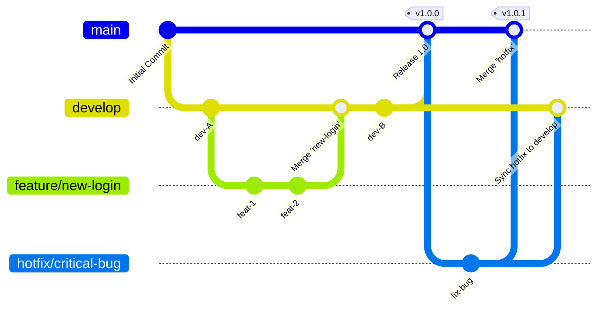
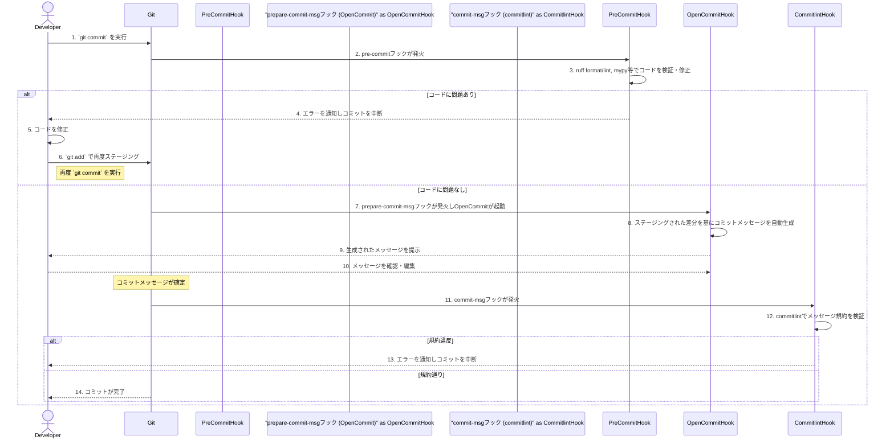
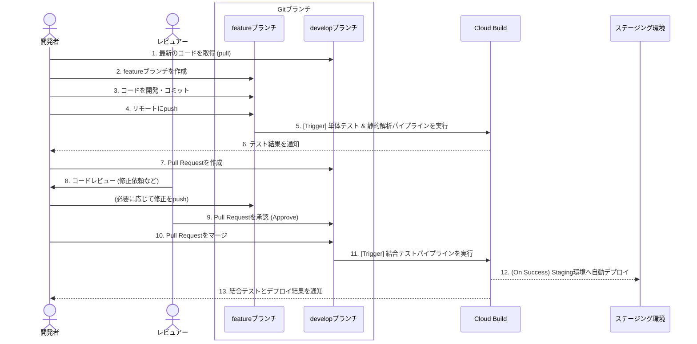
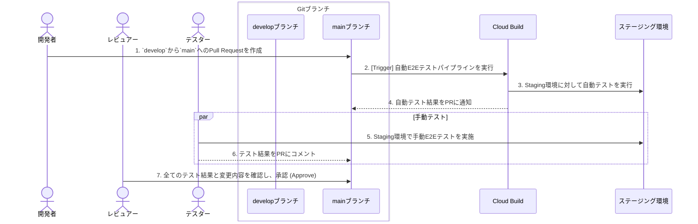
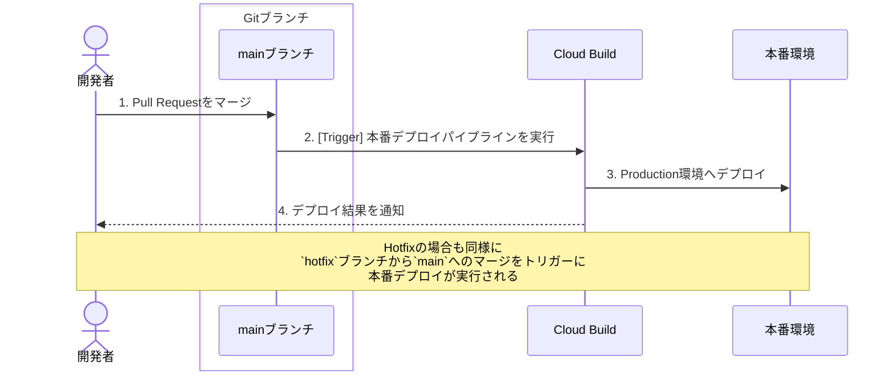

# 開発ガイドライン
**Document Version: 1.2.0**
*(Last Updated: 2025-12-10)*

> [!NOTE]
> このドキュメントは開発プロセスに関する規約をまとめたものです。プロジェクト本体のバージョンとは独立して管理されます。

---

このドキュメントは、本プロジェクトにおける開発の進め方、コーディングスタイル、利用ツールに関する規約を定めたものです。開発に参加するすべてのメンバーは、このガイドラインに従ってください。

開発環境のセットアップについては、プロジェクトルートの [`README.md`](../README.md) を参照してください。

---

## 1. 開発ワークフローとブランチ戦略

本セクションでは、プロジェクトで採用するGitブランチ戦略と、それに伴う開発ワークフローについて解説します。継続的な開発と安定したリリースを両立させることを目的としています。

### 1.1. 基本的な考え方

- **`main`ブランチ**: 常に**本番環境で動作可能**な、安定した状態を保ちます。
- **`develop`ブランチ**: 次期リリースに向けた開発内容を統合するブランチです。すべての機能開発やバグ修正は、一度このブランチにマージされます。
- **Pull Request (PR)**: `main`や`develop`へのマージは、必ずPull Requestを通じて行い、コードレビューを必須とします。
- **ブランチは目的別に作成**: 機能追加、バグ修正など、目的が明確なブランチを作成し、作業完了後は速やかに削除します。

### 1.2. ブランチの種類と役割

#### 主要ブランチ

- **`main`**
  - 本番環境（Production）にリリースされているコードの最新版です。
  - このブランチへの直接のコミットは**固く禁止**します。
  - `develop`ブランチからのマージ、または緊急の`hotfix`ブランチからのマージのみを受け入れます。

- **`develop`**
  - 開発中の最新バージョンです。開発のベースとなる中心的なブランチです。
  - `feature`ブランチや`bugfix`ブランチのマージ先となります。
  - このブランチは、ステージング環境（Staging）へ自動的にデプロイされることがあります。

#### 作業ブランチ

- **`feature/<feature-name>`**
  - 新しい機能の開発を行うためのブランチです。
  - 必ず`develop`ブランチから作成します。
  - 作業完了後、`develop`ブランチに対してPull Requestを作成します。
  - 例: `feature/user-authentication`, `feature/llm-integration`

- **`bugfix/<bug-name>`**
  - `develop`ブランチ上で見つかったバグを修正するためのブランチです。
  - `develop`ブランチから作成します。
  - 修正完了後、`develop`ブランチに対してPull Requestを作成します。
  - 例: `bugfix/login-form-validation`

- **`hotfix/<fix-name>`**
  - **本番環境で発生した緊急のバグ**を修正するためのブランチです。
  - **`main`ブランチから直接作成**します。
  - 修正完了後、**`main`と`develop`の両方**に対してPull Requestを作成し、マージします。（`develop`へのマージを忘れないように注意してください）
  - 例: `hotfix/critical-api-error`

### 1.3. ワークフローの視覚的表現

Mermaid.jsによるブランチの流れの図です。



### 1.4. 一般的な開発フロー（新機能開発）

1.  **ブランチの作成**:
    -   ローカルの`develop`ブランチを最新の状態にします (`git pull origin develop`)。
    -   `develop`ブランチから`feature`ブランチを作成します (`git checkout -b feature/my-new-feature`)。

2.  **開発とコミット**:
    -   機能開発を行い、作業の区切りが良い単位でコミットします。コミットメッセージは規約に従ってください。

3.  **プッシュ**:
    -   作業ブランチをリモートリポジトリにプッシュします (`git push origin feature/my-new-feature`)。

4.  **Pull Requestの作成**:
    -   GitHub上で、`feature/my-new-feature`ブランチから`develop`ブランチへのPull Requestを作成します。
    -   PRのテンプレートに従い、変更の概要、目的、テスト内容などを記述します。

5.  **コードレビューと修正**:
    -   チームメンバーによるコードレビューを受けます。
    -   指摘事項があれば、ローカルの`feature`ブランチで修正し、再度プッシュします。PRは自動的に更新されます。

6.  **マージ**:
    -   レビューで承認（Approve）され、自動テスト（CI）がすべて成功したら、PRをマージします。
    -   マージ後、不要になった`feature`ブランチは削除します。

### 1.5. リリースフロー

1.  `develop`ブランチのコードがリリースの基準に達したら、`develop`から`main`へのPull Requestを作成します。
2.  このPRは、最終的なリリースレビューとして機能します。
3.  承認後、PRを`main`にマージします。
4.  `main`ブランチにマージされたコミットに対して、`v1.1.0`のような形式でGitのタグを付与し、リリースノートを作成します。
5.  このタグをトリガーとして、本番環境へのデプロイが実行されます。

---

## 2. コミットに関する規約

### 2.1. コミットメッセージ規約

コミットメッセージは、変更内容を明確に伝えるための重要な情報です。本プロジェクトでは `Conventional Commits` に基づく規約と、`opencommit` によるメッセージの自動生成を採用しています。

#### 2.1.1. コミットメッセージの自動生成 (opencommit)

`opencommit` は `git commit` 時にフックとして実行され、ステージングされた変更内容からAIがコミットメッセージを自動生成します。開発環境のセットアップでフックが有効化されていることが前提です。

`git commit` を実行すると自動的に `opencommit` が起動し、コミットメッセージの生成を対話形式でサポートします。生成されたメッセージを確認し、必要に応じて修正してからコミットを完了してください。

#### 2.1.2. コミットメッセージのフォーマット

コミットメッセージは `commitlint` によって以下の規約に従っているかチェックされます。

-   **基本フォーマット:** [Conventional Commits](https://www.conventionalcommits.org/) に従います。
    ```
    <type>(<scope>): <subject>
    ```
-   **独自規約 (日英併記):**
    -   ヘッダー（1行目）は、**`英語コミットメッセージ / 日本語の要約`** の形式で記述する必要があります。
    -   `English / Japanese` の間は ` / `（スペース、スラッシュ、スペース）で区切ってください。
    -   英語部分はASCII文字のみを使用してください。

    **良い例:**
    ```
    feat(auth): add login feature / feat(auth): ログイン機能の追加
    ```
    **悪い例:**
    ```
    feat(auth): ログイン機能を追加
    feat(auth): add login feature
    feat(auth): add login feature/ログイン機能の追加
    ```

#### 2.1.3. コミットメッセージのチェック

このチェックは `pre-commit` の `commit-msg` フックとして設定されており、`git commit` 時に自動的に実行されます。規約違反がある場合はコミットが失敗しますので、メッセージを修正してください。

#### 2.1.4. 複数の変更をコミットする場合の注意点

ステージングされたファイルに複数の異なる関心事（ロジックの変更、ドキュメントの修正など）が含まれている場合、`opencommit`が複数のコミットメッセージ候補を生成することがあります。

Conventional Commitsの理想は「1コミット = 1つの関心事」です。そのため、複数のメッセージが提案された場合は、以下のいずれかの対応を推奨します。

1.  **コミットを分割する（推奨）**
    現在のコミットを中断し (`Ctrl+C`等)、`git add -p` や `git add <file>` を使って関心事ごとにファイルをステージングし直し、それぞれ個別にコミットします。これは最もクリーンなアプローチです。

2.  **メッセージを1つにまとめる**
    変更内容が密接に関連している場合に限り、`opencommit`が提案した複数のメッセージを、より抽象的で包括的な1つのメッセージに手動で編集します。

### 2.2. コミットの中断・修正方法

#### コミットを中断する
`opencommit`によってVimなどのエディタが起動した後、コミット自体を取りやめたい場合は、単に`:q`で閉じるのではなく、必ず以下のコマンドでエディタを終了してください。
```vim
:cq
```
これにより、エディタがエラーを返して終了するため、Gitのコミットプロセスが安全に中断されます。

#### コミットメッセージを修正する
`commitlint`のチェックを通過できなかった場合や、`opencommit`の生成内容をやり直したい場合の手順です。

**A. 直前のコミットを修正する**

1.  以下のコマンドを実行し、直前のコミットを取り消して、変更内容をステージングエリアに戻します。
    ```bash
    git reset --soft HEAD~1
    ```
2.  再度`git commit`を実行します。
    ```bash
    git commit
    ```
3.  これにより`opencommit`が再起動し、コミットメッセージを新たに生成できます。

> **Note:** この操作も履歴の書き換えです。`main`ブランチなど、既に他の開発者と共有しているブランチにプッシュ（push）済みのコミットには実行しないでください。

**B. 過去のコミットを修正する (複数前)**

インタラクティブ・リベース（`git rebase -i`）と`edit`を組み合わせることで、過去のコミットに対してもフックを再実行します。

1.  修正したいコミットが含まれる範囲を指定して、リベースを開始します。例えば「3つ前までのコミット」を対象にする場合は以下のコマンドを実行します。
    ```bash
    git rebase -i HEAD~3
    ```
2.  エディタが起動し、対象コミットの一覧が表示されます。メッセージを修正したいコミットの行の先頭にある `pick` という単語を `edit` (または `e`) に書き換えて、ファイルを保存・終了します。
    ```
    # 例: e4f5g6h のメッセージを修正する場合
    edit e4f5g6h fix: some bug  # <-- pick を edit に変更
    pick a1b2c3d feat: old feature
    pick i7j8k9l docs: update README
    ```
3.  リベースが`edit`を指定したコミットで一時停止します。ここで、そのコミットを取り消し、ステージングに戻します。
    ```bash
    git reset --soft HEAD~1
    ```
4.  再度`git commit`を実行して、`opencommit`を起動しメッセージを再生成します。
    ```bash
    git commit
    ```
5.  最後に、リベースを続行して完了させます。
    ```bash
    git rebase --continue
    ```

> **Warning:** 過去のコミットの修正は、コンフリクトが発生する可能性がより高い複雑な操作です。共有ブランチにプッシュ済みのコミットに対して行う場合は、必ずチームで合意の上、細心の注意を払って実施してください。

---

## 3. 品質保証のプロセス

コードの品質は、自動化されたチェックと人間によるレビューの組み合わせによって担保されます。

### 3.1. 静的解析・フォーマット (`pre-commit`フック)

本プロジェクトでは、コミット前にコードの品質を自動的にチェックするため `pre-commit` を導入しています。開発環境のセットアップでフックを有効化すると、`git commit` を実行するたびに、`.pre-commit-config.yaml` で定義されたチェックが自動的に実行されます。

#### 3.1.1. チェック内容

実行される主なチェックは以下の通りです。

-   **基本チェック (`pre-commit-hooks`):**
    -   `trailing-whitespace`: 行末の不要なスペースを削除します。
    -   `end-of-file-fixer`: ファイルの末尾に空行を1行確保します。
    -   `check-yaml`: YAMLファイルの構文をチェックします。
    -   `check-added-large-files`: 巨大なファイルがコミットされるのを防ぎます。
    -   `detect-private-key`: プライベートキーが誤ってコミットされるのを防ぎます。
-   **フォーマット (`ruff format`):**
    -   Pythonコードを規約に沿って自動的にフォーマットします。
-   **リンティング (`ruff`):**
    -   Pythonコードの静的解析を行い、潜在的なバグやスタイル違反を検出・修正します。
-   **型チェック (`mypy`):**
    -   Pythonコードの型ヒントを静的にチェックします。設定は `--strict` ですが、インポートエラーは無視します (`--ignore-missing-imports`)。

#### 3.1.2. 手動でのチェック実行
コミットせずに手動でチェックを実行したい場合は、以下のコマンドを使用できます。

```bash
# すべてのファイルをフォーマット
ruff format .

# すべてのファイルに対してリンターを実行（自動修正付き）
ruff check . --fix

# 型チェックを実行
mypy .
```

### 3.2. コミットフックの全体像

`git commit` を実行すると、Gitフックを通じてコードの自動チェック・整形、コミットメッセージの自動生成、メッセージ規約の検証が実行されます。全体の流れは以下の通りです。



### 3.3. Pull Request (PR) とコードレビュー

-   **PRの作成ルール**:
    -   PRのタイトルは、コミットメッセージの規約に準拠します。
    -   PRの本文には、変更の背景（Why）、具体的な変更内容（What）、影響範囲を記述します。（テンプレートの利用を推奨）
    -   作業中のPRは、タイトルに`[WIP]`を付けるか、Draft Pull Requestとして作成します。
-   **コードレビューのガイドライン**:
    -   **レビュワーへ**: 変更の意図を尊重し、高圧的な表現を避けます。「なぜこの実装にしたのですか？」のように質問形式で意図を確認することを推奨します。
    -   **作成者へ**: レビューコメントに感謝し、感情的にならないようにします。すべての指摘を反映する必要はなく、議論を通じて最適な解を見つけます。

### 3.4. テストの方針

コードの品質と信頼性を担保するため、本プロジェクトでは複数のテストレベルを設けています。

-   **基本ルール**:
    -   新しい機能を追加する際は、可能な限りユニットテストを追加します。
    -   重大なバグを修正した際は、再発防止のためのテストコードを追加します。

#### 3.4.1. テストの実行環境とタイミング

各テストは、開発者のローカル環境とCI/CDパイプラインの両方で実行されます。それぞれの環境と実行タイミングは以下の通りです。CI/CDパイプラインの具体的なトリガーについては、「[5. CI/CD ガイドライン](#5-cicd-ガイドライン)」セクションも参照してください。

| テスト種別 | 実行環境          | 実行タイミング・方法                                                                                                                              | 主な目的                                                       |
| :----------- | :---------------- | :------------------------------------------------------------------------------------------------------------------------------------------------ | :--------------------------------------------------------------- |
| **単体試験** | ローカル / CI     | **ローカル:** `uv run test` で手動実行<br>**CI:** `feature`ブランチへのpush時、`develop`へのPR作成時に自動実行                          | 個々の関数やモジュールの動作保証                               |
| **結合試験** | CI / ステージング | **CI:** `develop`ブランチへのマージ時に自動実行                                                                                                   | 複数モジュール間の連携確認                                     |
| **E2E試験**  | CI / ステージング | **CI (自動):** `main`ブランチへのPR作成時に、ステージング環境に対して自動実行<br>**手動:** 新機能の追加時やリリース前に、ステージング環境で都度実行 | ユーザー操作シナリオ全体の動作保証と、UX（使い勝手）の最終確認 |

#### 3.4.2. テストの種類とスコープ

各テストが対象とする範囲（スコープ）と目的は以下の通りです。ピラミッドのように、単体試験が最も数が多く、E2E試験が最も少なくなるのが理想です。

**1. 単体試験 (Unit Test)**

-   **目的**: 一番小さな単位（関数やメソッド、コンポーネントなど）が、個別に正しく動作するかを確認します。
-   **視点**: 開発者の視点（実装の詳細を理解している）
-   **具体例**:
    -   ある関数に特定の入力（引数）を与えたとき、期待通りの出力（戻り値）が返ってくるか。
    -   入力が不正な場合に、正しくエラーがスローされるか。
    -   例えば、ファイル名を引数に取り、その拡張子を返す `get_file_extension(filename)` という関数があったとします。
        -   `get_file_extension("data.csv")` を実行したら `"csv"` が返ってくるか。
        -   `get_file_extension("archive.tar.gz")` を実行したら `"gz"` が返ってくるか。
        -   `get_file_extension("README")` を実行したら `None` や空文字が返ってくるか。
        -   `get_file_extension(None)` を実行したら `TypeError` が発生するか。

**2. 結合試験 (Integration Test)**

-   **目的**: 複数のコンポーネント（モジュールやクラス、マイクロサービスなど）を組み合わせたときに、それらが連携して正しく動作するかを確認します。
-   **視点**: 開発者の視点（システムの内部構造を理解している）
-   **具体例**:
    -   Webアプリケーションで、APIリクエストを送信し、データベースに正しくデータが保存・更新されるか。
    -   あるモジュールの出力が、別のモジュールの入力として正しく処理されるか。
    -   例えば、「AI検索アプリ」で考えてみましょう。
        1.  ユーザーが検索クエリを入力する「① UIコンポーネント」
        2.  クエリを受け取り、AIモデルに問い合わせる「② APIサーバー」
        3.  検索結果を保存する「③ データベース」
        -   結合試験では、UIは使わずに直接「② APIサーバー」にリクエストを送り、「③ データベース」の状態が期待通りに変わるかを確認します。外部のAIモデルへの接続部分は、本物の代わりにダミー（モック）を使うことも多いです。

**3. E2E試験 (End-to-End Test)**

-   **目的**: 実際のユーザーと同じようにアプリケーション全体を操作し、最初から最後まで（End-to-End）のシナリオが正しく動作するかを確認します。
-   **視点**: ユーザーの視点（アプリケーションの内部実装は知らない）
-   **具体例**:
    -   Webサイトにアクセスし、ログインボタンをクリックし、フォームに情報を入力してログインし、特定のページが表示されるまでの一連の流れ。
    -   ECサイトで商品を検索し、カートに追加し、購入手続きを完了させるまでの一連の操作。
    -   「AI検索アプリ」の例で言えば、
        1.  ブラウザを自動で起動する。
        2.  検索ページを開く。
        3.  検索ボックスに「今日の天気は？」と入力してEnterキーを押す。
        4.  検索結果が画面に正しく表示されることを確認する。
        -   この試験では、UI、API、データベース、外部サービスなど、本番とほぼ同じ環境のすべてが連携して動作することを確認します。CI/CDパイプラインによる主要シナリオの**自動テスト**と、開発者やQA担当者による探索的な**手動テスト**の両方のアプローチで実施されます。

---

## 4. その他の規約

### 4.1. 依存関係の管理

-   **目的**: プロジェクトの依存ライブラリを健全に保ち、意図しない更新を防ぎます。
-   **ルール**:
    -   新しいライブラリを追加する際は、PR上でチームに提案し、承認を得ることを推奨します。
    -   ライブラリのバージョンは、セキュリティアップデートを除き、むやみに更新しません。

---

## 5. CI/CD ガイドライン

このセクションでは、このプロジェクトにおけるCI/CD (継続的インテグレーション/継続的デプロイメント) 戦略の概要を説明します。

### 5.1. CI/CD ツール

### ソースコード管理

- **ツール:** GitHub

### CI/CDプラットフォーム

- **ツール:** Google Cloud Build
- **詳細:** ソースコードはGitHubで管理しますが、CI/CDプラットフォームとしてはGoogle Cloud Buildを利用します。

### 5.2. パイプラインの実行トリガー

パイプラインは、上記のブランチ戦略に基づいてトリガーされます。これにより、迅速なフィードバックと徹底的な検証のバランスを保ちます。

#### 5.2.1. 単体テスト & 静的解析

- **目的:**
  - 個々のコンポーネントが正しく機能することを確認します。
  - コーディング規約を徹底し、潜在的なバグを早期に発見します。
- **トリガー:**
  - **`feature/*` ブランチへの push 時:** 開発者が自身の変更に対して迅速なフィードバックを得られるようにします。
  - **`develop` ブランチへのプルリクエスト時:** `develop` ブランチにマージされる前に、変更がメインの開発ブランチを破壊しないことを保証します。

#### 5.2.2. 結合テスト

- **目的:**
  - 異なるコンポーネントやサービスが、期待通りに連携して動作することを確認します。
- **トリガー:**
  - **`develop` ブランチへのマージ (push) 時:** メインの開発ブランチに統合されたコードベースの安定性を検証します。

#### 5.2.3. E2E (End-to-End) テスト

- **目的:**
  - 本番に近い環境でシステム全体の最終検証を行います。主要なシナリオは自動化し、手動テストで探索的な検証やUXの確認を行います。
- **トリガー:**
  - **`main` ブランチへのプルリクエスト時:** `develop` ブランチから `main` へのマージ前に、ステージング環境などで最終的なE2Eテストを実行します。

#### 5.2.4. 本番デプロイ

- **目的:**
  - アプリケーションを本番環境へデプロイします。
- **トリガー:**
  - **`main` ブランチへのマージ (push) 時:** 本番環境へデプロイします。
  - **`hotfix/*` ブランチのマージ時:** 緊急の修正を本番環境へデプロイします。

### 5.3. CI/CDフローの視覚的表現

以下に、CI/CDの各フェーズにおけるフローをシーケンス図で示します。

#### 5.3.1. 開発および単体・結合テスト

このフローは、機能開発から`develop`ブランチへの統合までを対象とします。



#### 5.3.2. E2Eテストとリリースレビュー

このフローは、`main`ブランチへのマージ前に行われる最終テストフェーズです。自動テストと手動テストの両方が含まれます。



#### 5.3.3. リリース

このフローは、`main`ブランチへのマージをトリガーとした本番環境へのリリース作業です。



---

## 更新履歴 (Changelog)
- **v1.1.0 (2025-12-10):** テストの方針とCI/CDガイドラインを追記。
- **v1.0.0 (2025-12-08):** 初版作成
